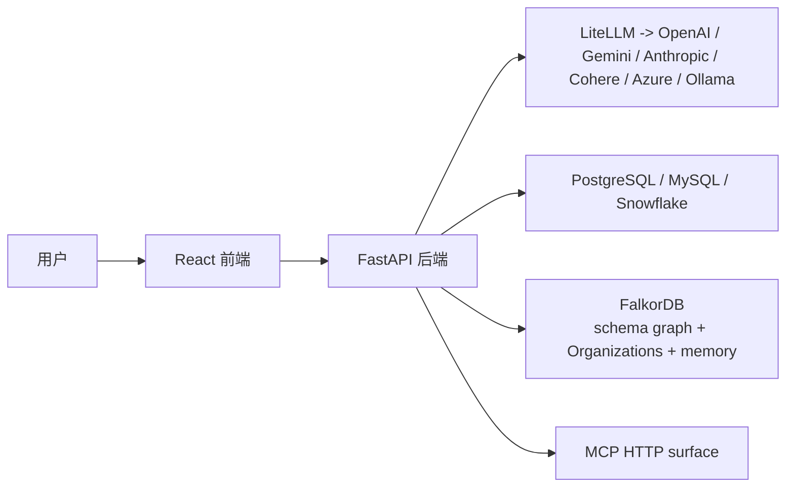

# QueryWeaver 项目深度说明文档

本文档基于当前仓库代码整理，目标是帮助开发者快速理解 QueryWeaver 的定位、架构、核心流程、前后端组织方式，以及当前实现状态与注意事项。

适用仓库：`D:\QueryWeaver-staging`

更新时间：`2026-04-24`

---

## 1. 项目是什么

QueryWeaver 是一个面向关系型数据库的 **Text2SQL 系统**。它允许用户直接用自然语言提问，例如：

- “上个月新增了多少用户？”
- “收入最高的 10 个客户是谁？”
- “有哪些订单还没发货？”

系统会：

1. 理解用户问题。
2. 从数据库 schema 中找出相关表、列和关系。
3. 生成 SQL。
4. 执行 SQL。
5. 将结果整理成更适合人阅读的回答。

它不是一个单纯“让 LLM 硬写 SQL”的应用，而是一个 **图驱动的 schema 理解系统**。

---

## 2. 项目的核心卖点

和普通的 Text2SQL 工具相比，QueryWeaver 的关键差异在于：

### 2.1 先把 schema 转成图

项目会把数据库中的：

- 表
- 列
- 外键关系
- 表/列说明
- 表/列的向量 embedding

加载到 FalkorDB 中，形成一个可检索的图结构。

这意味着系统不是直接把整个 schema 文本塞给模型，而是先在图里做“相关 schema 子图检索”，再让 LLM 仅基于更相关、更小范围的结构生成 SQL。

### 2.2 图检索 + 向量检索 + 路径扩展

针对用户问题，系统会：

1. 先用 LLM 生成“相关表描述/列描述”。
2. 把这些描述转成 embedding。
3. 在 FalkorDB 的 `Table` / `Column` 向量索引上检索。
4. 再沿着外键关系扩一圈“邻域表”。
5. 再做表与表之间的最短路径搜索，补上连接链路。

这样做的目的，是让最终送进 SQL 生成 Agent 的 schema 更精准。

### 2.3 不只生成 SQL，还执行 SQL

后端不仅会生成 SQL，还会：

- 实际连接目标数据库执行查询
- 对执行失败的 SQL 尝试自动修复
- 在返回前用另一个 Agent 把结果转成用户可读答案
- 对破坏性 SQL 做二次确认

因此它更像一个“数据库问答代理系统”，而不是一个“SQL 字符串生成器”。

---

## 3. 项目解决的问题

这个项目面向的典型场景包括：

- 非技术人员想直接通过自然语言查询数据库
- 数据分析同学希望更快写出 SQL
- 内部 BI 或数据助手需要接入数据库问答能力
- 需要对数据库 schema 做语义级检索，而不是只靠关键词匹配
- 希望支持多模型、多数据库、多认证方式

---

## 4. 整体架构概览

QueryWeaver 是一个前后端单仓库：

- 后端：FastAPI
- 前端：React + TypeScript + Vite
- 图数据库：FalkorDB
- LLM 接入层：LiteLLM
- 记忆系统：Graphiti

### 4.1 高层结构



### 4.2 关键运行角色

- React 前端负责登录、数据库选择、聊天界面、schema 可视化、设置页。
- FastAPI 后端负责鉴权、连接数据库、构建 schema graph、查询流水线、流式返回结果。
- FalkorDB 既承担 schema graph 的存储，也承担组织/身份/token 图和部分记忆能力。
- LiteLLM 统一封装对不同 LLM 提供方的调用。

---

## 5. 仓库结构

```text
api/              FastAPI 后端
  agents/         LLM agent 逻辑
  auth/           OAuth、邮箱认证、用户/token 管理
  core/           Text2SQL 核心流程
  loaders/        外部数据库 schema 加载与 SQL 执行
  memory/         Graphiti 记忆能力
  routes/         API 路由
  sql_utils/      SQL 标识符修正

app/              React 前端
  src/components/ UI 与功能组件
  src/contexts/   Auth / Database / Chat / Settings 上下文
  src/services/   API 请求封装
  src/pages/      首页、设置页、404

tests/            pytest 单元/集成测试
e2e/              Playwright 端到端测试
docs/             补充文档
```

---

## 6. 后端架构详解

## 6.1 入口与应用工厂

后端入口是：

- `api/index.py`
- `api/app_factory.py`

`api/index.py` 会先加载 `.env`，再调用 `create_app()` 创建 FastAPI 实例。

`api/app_factory.py` 负责：

- 注册所有 FastAPI 路由
- 配置 SessionMiddleware
- 配置安全中间件
- 配置 CSRF 中间件
- 挂载前端构建产物 `app/dist`
- 初始化 OAuth
- 根据环境变量决定是否开启 MCP HTTP surface

这意味着 QueryWeaver 在生产模式下是一个“单服务部署”的应用：同一个 FastAPI 进程同时提供 API、MCP 和前端静态资源。

---

## 6.2 中间件与安全机制

项目后端实现了几层基础安全能力：

### 6.2.1 SessionMiddleware

用于浏览器登录态管理，依赖 `FASTAPI_SECRET_KEY`。

### 6.2.2 SecurityMiddleware

主要做两件事：

- 防止静态文件目录穿越
- 给响应统一加上 HSTS 头

### 6.2.3 CSRFMiddleware

实现的是“双提交 Cookie”模式：

- 服务端确保存在 `csrf_token` cookie
- 对非安全方法的请求要求携带 `X-CSRF-Token`
- Bearer Token 请求与部分 OAuth/MCP 路径豁免

### 6.2.4 基于 token 的接口保护

后端通过 `token_required` 装饰器保护大部分需要用户上下文的接口。它支持从以下位置提取 token：

- `api_token` cookie
- query 参数
- `Authorization: Bearer ...`

认证成功后，会把用户 email 做 Base64 编码后写到 `request.state.user_id`，作为图名空间的一部分。

---

## 6.3 鉴权与用户体系

用户与 token 信息存储在 FalkorDB 的 `Organizations` 图中。

### 6.3.1 支持的认证方式

- Google OAuth
- GitHub OAuth
- Email/Password
- API Token

### 6.3.2 相关模块

- `api/routes/auth.py`
- `api/auth/user_management.py`
- `api/auth/oauth_handlers.py`

### 6.3.3 鉴权后的数据隔离方式

业务图名称通常是：

```text
{base64(email)}_{database_name}
```

这样不同用户即使加载了同名数据库，也会被隔离到不同的图中。

### 6.3.4 API Token 管理

`api/routes/tokens.py` 提供：

- 生成 token
- 列出 token
- 删除 token

这使得 QueryWeaver 不只适合网页使用，也适合脚本、CLI 或外部服务调用。

---

## 6.4 API 路由分层

后端路由主要分为几类：

### 6.4.1 `api/routes/auth.py`

负责：

- OAuth 登录入口和回调
- 邮箱注册/登录
- 查询认证状态
- 登出
- 首页静态回退

### 6.4.2 `api/routes/database.py`

负责：

- 通过数据库连接串接入外部数据库
- 触发 schema 抽取与图加载

### 6.4.3 `api/routes/graphs.py`

负责：

- 列出当前用户可见的图/数据库
- 获取 schema 图数据
- 发起 Text2SQL 查询
- 破坏性操作确认
- 手动刷新 schema graph
- 删除图
- 读取/更新 user rules

### 6.4.4 `api/routes/settings.py`

负责：

- 校验用户输入的模型 API Key 是否可用

---

## 6.5 关键后端接口

以下是当前代码中最重要的接口：

### 6.5.1 认证

- `GET /auth-status`
- `GET /login/google`
- `GET /login/github`
- `POST /login/email`
- `POST /signup/email`
- `GET|POST /logout`

### 6.5.2 数据库与图

- `POST /database`
- `GET /graphs`
- `GET /graphs/{graph_id}/data`
- `POST /graphs/{graph_id}`
- `POST /graphs/{graph_id}/confirm`
- `POST /graphs/{graph_id}/refresh`
- `DELETE /graphs/{graph_id}`
- `GET /graphs/{graph_id}/user-rules`
- `PUT /graphs/{graph_id}/user-rules`

### 6.5.3 token 与设置

- `POST /tokens/generate`
- `GET /tokens/list`
- `DELETE /tokens/{token_id}`
- `POST /settings/validate-api-key`

---

## 6.6 Text2SQL 核心流水线

核心逻辑位于：

- `api/core/text2sql.py`
- `api/graph.py`
- `api/agents/*`

这是整个项目最重要的部分。

### 6.6.1 请求输入

`POST /graphs/{graph_id}` 接收的主要数据结构是 `ChatRequest`：

- `chat`: 用户问题历史
- `result`: 之前的回答历史
- `instructions`: 可选附加指令
- `custom_api_key`: 可选自定义模型密钥
- `custom_model`: 可选自定义模型
- `use_user_rules`: 是否读取数据库中的用户规则
- `use_memory`: 是否启用记忆

### 6.6.2 主流程阶段

一个查询大致分为以下阶段：

1. 校验请求与历史上下文。
2. 获取数据库描述与数据库连接串。
3. 可选读取用户规则。
4. 根据 DB URL 判断数据库类型和对应 loader。
5. 并行执行：
   - RelevancyAgent 判断问题是否与数据库相关
   - 图检索 `find()` 查找相关表/列
6. 如果问题离题，直接返回 follow-up/off-topic 响应。
7. 如果相关：
   - 可选加载 memory context
   - 用 AnalysisAgent 生成 SQL、置信度、歧义说明、缺失信息等
8. 将 SQL 以流式消息返回前端。
9. 若 SQL 可执行：
   - 自动修正特殊字符表名
   - 判断是否为破坏性操作
   - 执行 SQL
   - 执行失败则尝试 healer 修复
   - 若 schema 被改动则刷新图
   - 用 ResponseFormatterAgent 生成人类可读回答
10. 将问答摘要写入记忆系统。

---

## 6.7 图检索是怎么工作的

相关逻辑位于 `api/graph.py`。

### 6.7.1 `find()` 的步骤

`find()` 并不是简单按表名搜索，而是：

1. 用 `Config.FIND_SYSTEM_PROMPT` 让 LLM 产出：
   - 相关表描述
   - 相关列描述
2. 使用 embedding 模型对这些描述向量化。
3. 对 `Table.embedding` 做向量检索。
4. 对 `Column.embedding` 做向量检索。
5. 对已找到的表做“邻域扩展”。
6. 对表对之间做最短路径搜索，补齐中间连接表。
7. 去重后把相关表结构返回给后续 SQL 生成 Agent。

### 6.7.2 为什么这样设计

这样设计的价值在于：

- 避免把完整 schema 全量喂给 LLM
- 能利用外键关系理解 join 路径
- 对表/列描述而不是纯名字做语义检索
- 对复杂问题更容易找到桥接表

---

## 6.8 多 Agent 分工

`api/agents/` 中不同 Agent 各司其职：

### 6.8.1 AnalysisAgent

负责：

- 结合用户问题、相关 schema、历史上下文、memory、user rules 生成 SQL
- 输出 SQL 的解释、歧义、缺失信息、可翻译性判断

### 6.8.2 RelevancyAgent

负责判断问题是否与当前数据库相关。

例如：

- 问数据库里的销售数据，属于 on-topic
- 问天气、编程问题，可能是 off-topic

### 6.8.3 FollowUpAgent

当问题不能直接转成 SQL 时，负责生成澄清问题。

### 6.8.4 ResponseFormatterAgent

将 SQL 结果重新组织成自然语言回答，而不是把原始表格直接扔给用户。

### 6.8.5 HealerAgent

当 SQL 执行报错时：

- 接收失败 SQL
- 接收数据库错误信息
- 尝试最小修复
- 再次执行
- 最多尝试多轮

它不是重新做一遍完整 SQL 生成，而是专门做“基于报错的修复”。

---

## 6.9 SQL 执行与修复

### 6.9.1 正常执行

生成 SQL 后，会调用对应 loader 的 `execute_sql_query()` 执行。

不同数据库使用不同 loader：

- `PostgresLoader`
- `MySQLLoader`
- `SnowflakeLoader`

### 6.9.2 自动标识符加引号

`api/sql_utils/sql_sanitizer.py` 会自动处理表名里带特殊字符的情况，例如：

- `my-table`
- `sales.order`

项目会根据数据库类型选择引号字符：

- PostgreSQL：`"`
- MySQL：`` ` ``

### 6.9.3 执行失败后的 healer

如果初始 SQL 执行失败：

1. 后端发出 `reasoning_step`
2. 创建 `HealerAgent`
3. 将 SQL、报错、数据库类型、原问题等喂给 healer
4. healer 尝试修复并再次执行
5. 成功则继续流程
6. 失败则发出错误消息

---

## 6.10 破坏性 SQL 的确认机制

后端会识别以下操作为破坏性操作：

- `INSERT`
- `UPDATE`
- `DELETE`
- `DROP`
- `CREATE`
- `ALTER`
- `TRUNCATE`

处理策略：

- 如果是用户自己的图：先返回 `destructive_confirmation`，等待用户确认
- 如果是 demo 图：拒绝执行

用户确认后，会调用：

- `POST /graphs/{graph_id}/confirm`

后端再执行真正的操作。

---

## 6.11 Schema graph 的构建过程

相关模块：

- `api/routes/database.py`
- `api/core/schema_loader.py`
- `api/loaders/*.py`
- `api/loaders/graph_loader.py`

### 6.11.1 接入数据库

当前明确支持的数据库类型：

- PostgreSQL
- MySQL
- Snowflake

`POST /database` 接收连接串后，会：

1. 判断数据库类型。
2. 用对应 loader 连接数据库。
3. 抽取表、列、主键、外键、注释、样本值等信息。
4. 调用 `load_to_graph()` 写入 FalkorDB。

### 6.11.2 入图后的节点/边

典型图结构包括：

- `Database`
- `Table`
- `Column`
- `(:Column)-[:BELONGS_TO]->(:Table)`
- `(:Column)-[:REFERENCES]->(:Column)`

### 6.11.3 向量索引

入图时会为：

- `Table.embedding`
- `Column.embedding`

建立向量索引，以支持后续语义检索。

### 6.11.4 自动生成描述

项目会调用 LLM：

- 为表生成一句简洁描述
- 为数据库整体生成一句简洁描述

这些描述会进一步提升后续的检索和 SQL 生成质量。

---

## 6.12 Memory 记忆系统

相关模块：

- `api/memory/graphiti_tool.py`

### 6.12.1 使用目的

它不是简单聊天历史缓存，而是更结构化的“用户和数据库交互记忆”。

它会记录：

- 用户问了什么
- 生成了什么 SQL
- 是否成功
- 得到了什么回答
- 用户长期偏好和习惯

### 6.12.2 底层实现

该模块通过 Graphiti 与 FalkorDB 配合，维护用户级记忆图。

### 6.12.3 TTL 支持

如果设置 `MEMORY_TTL_SECONDS`，记忆图可以带过期时间，避免长期无限增长。

---

## 6.13 MCP 支持

QueryWeaver 不只是 Web App，还可以暴露 MCP HTTP surface。

在 `api/app_factory.py` 中，如果没有设置 `DISABLE_MCP=true`，应用会自动从 FastAPI 路由生成 MCP 能力。

README 中列出的 MCP 方向包括：

- `list_databases`
- `connect_database`
- `database_schema`
- `query_database`

这说明 QueryWeaver 可以作为别的 AI 系统的数据库问答后端。

---

## 7. 前端架构详解

前端位于 `app/`，技术栈为：

- React 18
- TypeScript
- Vite
- Tailwind CSS
- Radix UI
- React Router
- React Context

---

## 7.1 前端入口

关键文件：

- `app/src/main.tsx`
- `app/src/App.tsx`

`main.tsx` 负责：

- 初始化主题
- 挂载 React 根节点

`App.tsx` 负责：

- 注入 QueryClient
- 注入 Auth / Database / Settings / Chat Context
- 定义页面路由

当前页面主要有：

- `/` 首页
- `/settings` 设置页

---

## 7.2 前端状态管理

项目主要通过 React Context 管理状态：

### 7.2.1 `AuthContext`

负责：

- 认证状态
- 当前用户
- 登录
- 登出

### 7.2.2 `DatabaseContext`

负责：

- 图/数据库列表
- 当前选中的图
- 刷新图列表
- 上传 schema
- 删除图

### 7.2.3 `ChatContext`

负责：

- 当前聊天消息
- 会话历史
- 当前是否处理中
- 切换数据库时重置会话

### 7.2.4 `SettingsContext`

负责：

- 用户自定义模型 vendor
- 模型名
- 临时 API Key
- API Key 校验状态

注意：前端明确选择“不把 API Key 持久化到 localStorage”，只会持久化 vendor 和 modelName。

---

## 7.3 首页交互结构

首页位于 `app/src/pages/Index.tsx`，主要拼装了这些能力：

- 左侧 sidebar 展示数据库列表
- 中间 chat 区域负责问答
- 右侧/侧边 schema viewer 展示图结构
- 顶部或菜单里支持：
  - 登录/登出
  - 打开 token 管理
  - 连接数据库
  - 刷新 schema
  - 删除数据库

页面还支持：

- `useMemory` 开关
- `useRulesFromDatabase` 开关
- schema viewer 宽度拖拽
- GitHub stars 展示

---

## 7.4 聊天界面如何工作

相关文件：

- `app/src/components/chat/ChatInterface.tsx`
- `app/src/services/chat.ts`

### 7.4.1 前端发送查询

发送查询时，前端会：

1. 检查是否已选择数据库。
2. 从 `conversationHistory` 抽取历史消息。
3. 组装成后端需要的 `chat` / `result` 格式。
4. 调用 `POST /graphs/{graph_id}`。
5. 用流式方式逐段读取返回值。

### 7.4.2 流式消息类型

前端会处理多种消息类型，包括：

- `reasoning_step`
- `sql_query`
- `query_result`
- `ai_response`
- `followup_questions`
- `error`
- `destructive_confirmation`
- `schema_refresh`

### 7.4.3 前端如何渲染流

当前策略是：

- `reasoning_step` 直接作为普通 AI 消息插入聊天流
- `sql_query` 作为独立消息块展示
- `query_result` 作为表格展示
- `ai_response` 作为最终自然语言回答展示

这让用户可以看到系统“分析 -> 生成 SQL -> 执行 -> 输出答案”的全过程。

---

## 7.5 Schema Viewer

相关文件：

- `app/src/components/schema/SchemaViewer.tsx`

它会调用：

- `GET /graphs/{graph_id}/data`

拿到：

- `nodes`
- `links`

然后用 `@falkordb/canvas` 进行可视化。

可视化节点主要是表，节点内部会展示列名和类型，边主要表示外键关系。

---

## 7.6 设置页

设置页位于 `app/src/pages/Settings.tsx`，主要提供：

- 自定义模型 vendor
- 自定义 API Key
- 自定义模型名
- API Key 在线校验
- `useMemory` 开关
- `useRulesFromDatabase` 开关
- 当前数据库 user rules 编辑

关于 user rules：

- 它们存储在当前数据库图中的 `Database.user_rules`
- 在生成 SQL 时可选注入
- 用于表达用户对 SQL 生成的偏好与约束

---

## 8. 端到端调用链

下面按两个最关键的业务流程说明。

## 8.1 接入数据库流程

### 8.1.1 用户侧

用户在前端输入数据库连接串，或者通过 UI 表单拼接连接串。

### 8.1.2 后端侧

后端收到 `POST /database` 请求后：

1. 校验 URL。
2. 根据协议识别数据库类型。
3. 选择对应 loader。
4. 抽取 schema。
5. 生成表/列描述和 embedding。
6. 写入 FalkorDB 图。
7. 以流式步骤消息返回前端。

### 8.1.3 结果

数据库会出现在当前用户可见的图列表里，后续就可以直接用自然语言问它。

---

## 8.2 查询数据库流程

### 8.2.1 用户输入问题

例如：

```text
上个月每个地区的订单金额是多少？
```

### 8.2.2 前端发请求

前端携带：

- 当前数据库 ID
- 历史问题
- 历史回答
- 自定义模型配置
- memory / rules 开关

### 8.2.3 后端流水线

后端会：

1. 相关性判断
2. 图检索相关 schema
3. 生成 SQL
4. 返回 SQL 给前端
5. 执行 SQL
6. 失败则自动修复
7. 返回结果表格
8. 生成自然语言总结
9. 写入记忆

### 8.2.4 前端展示

用户会在聊天窗口里依次看到：

- 推理步骤
- SQL
- 查询结果
- 最终回答

---

## 9. 模型与提供方支持

模型配置位于 `api/config.py`。

项目统一通过 LiteLLM 调用模型，支持：

- OpenAI
- Gemini
- Anthropic
- Cohere
- Azure OpenAI
- Ollama

### 9.1 默认策略

后端会根据环境变量自动选择提供方，优先级大致是：

- `OLLAMA_MODEL`
- `OPENAI_API_KEY`
- `GEMINI_API_KEY`
- `ANTHROPIC_API_KEY`
- `COHERE_API_KEY`
- 否则默认走 Azure

### 9.2 这意味着什么

这说明项目：

- 既支持云端闭源模型 API
- 也支持通过 Ollama 接本地/自托管开源模型

但项目本身并不内置模型权重。

---

## 10. 环境变量与配置重点

最关键的配置包括：

### 10.1 基础运行

- `FASTAPI_SECRET_KEY`
- `FALKORDB_URL`

### 10.2 LLM 提供方

- `OPENAI_API_KEY`
- `GEMINI_API_KEY`
- `ANTHROPIC_API_KEY`
- `COHERE_API_KEY`
- `AZURE_API_KEY`
- `OLLAMA_MODEL`

### 10.3 模型覆盖

- `COMPLETION_MODEL`
- `EMBEDDING_MODEL`

### 10.4 认证相关

- `GOOGLE_CLIENT_ID`
- `GOOGLE_CLIENT_SECRET`
- `GITHUB_CLIENT_ID`
- `GITHUB_CLIENT_SECRET`
- `EMAIL_AUTH_ENABLED`
- `OAUTH_BASE_URL`

### 10.5 运行特性

- `DISABLE_MCP`
- `MEMORY_TTL_SECONDS`
- `GENERAL_PREFIX`

---

## 11. 开发、构建与测试

Makefile 中定义了主要命令。

### 11.1 安装

```bash
make install
```

会执行：

- `uv sync`
- `npm ci --prefix ./app`

### 11.2 开发环境

```bash
make setup-dev
```

### 11.3 启动

```bash
make run-dev
make run-prod
```

### 11.4 构建

```bash
make build-dev
make build-prod
```

### 11.5 测试

```bash
make test-unit
make test-e2e
make test
```

### 11.6 Lint

```bash
make lint
make lint-frontend
```

---

## 12. 测试结构

### 12.1 `tests/`

当前可见的测试覆盖点包括：

- CSRF middleware
- HSTS header
- PostgreSQL loader
- MySQL loader
- Snowflake loader
- settings route
- SQL sanitizer
- 简单集成测试

### 12.2 `e2e/`

E2E 目录下使用 Playwright，包含：

- `chat.spec.ts`
- `database.spec.ts`
- `sidebar.spec.ts`
- `userProfile.spec.ts`

同时还提供：

- 测试数据 SQL
- 页面对象模型
- API 与 UI 测试基础设施

---

## 13. 代码阅读建议顺序

如果你是第一次接手这个项目，建议按以下顺序阅读：

1. `README.md`
2. `api/app_factory.py`
3. `api/routes/graphs.py`
4. `api/core/text2sql.py`
5. `api/graph.py`
6. `api/loaders/graph_loader.py`
7. `api/loaders/postgres_loader.py`
8. `app/src/pages/Index.tsx`
9. `app/src/components/chat/ChatInterface.tsx`
10. `app/src/services/chat.ts`
11. `app/src/pages/Settings.tsx`

这样可以先理解主业务，再理解图检索和细节。

---

## 14. 当前实现状态与注意事项

这一节很重要。下面列的是“当前代码中已观察到的现状”，适合维护者重点关注。

### 14.1 README 与当前实现并非完全一致

README 把项目描述成一个支持上传 graph/schema、REST API、MCP 的完整系统，但从当前代码看，某些能力仍处于未完成或过渡状态。

### 14.2 `POST /graphs` 的上传能力尚未真正实现

`api/routes/graphs.py` 中：

- JSON 上传返回 `501`
- XML 上传返回 `501`
- CSV 上传返回 `501`

也就是说，当前“通过文件直接上传 schema 到 `/graphs`”这条路在代码里还是占位。

### 14.3 前端仍保留了一些旧接口痕迹

前端 `app/src/config/api.ts` 中仍定义了：

- `/upload`
- `/chat`
- `/confirm`
- `/user`

但当前后端实际主路径是：

- `POST /graphs/{graph_id}`
- `POST /graphs/{graph_id}/confirm`
- 没有发现 `/upload`
- 没有发现 `/user`

这说明前端存在一定的历史接口残留。

### 14.4 某些前端 service 与后端当前行为不完全匹配

例如：

- `DatabaseService.connectDatabase()` 期待普通 JSON 响应
- 但后端 `/database` 实际返回的是流式 `StreamingResponse`

因此这部分前端代码更像“尚未完全对齐新后端流式协议”。

### 14.5 `getGraph()` 调用的接口当前并不存在对应 GET 实现

前端有 `GET /graphs/{id}` 的 service，但后端当前在该路径上是 `POST /graphs/{graph_id}` 用于查询，不是获取 graph 详情。

这也属于接口演进过程中留下的残余调用定义。

### 14.6 Vendor 命名存在前后端映射层

前端设置页中用户选择的是：

- `openai`
- `google`
- `anthropic`

但实际发送到后端做校验时，会把 `google` 映射成 `gemini`。

这不是 bug，而是一个兼容层，但新维护者需要知道这一点。

### 14.7 OAuth cookie 的 `secure` 策略需要结合部署环境检查

在部分 OAuth 回调中，cookie 是按 `secure=True` 设置的；本地纯 HTTP 场景下需要确认这是否符合当前部署方式。

---

## 15. 对项目成熟度的判断

从当前代码看，项目已经具备较强的主线能力：

- 多数据库接入
- schema 图构建
- 图驱动检索
- LLM 生成 SQL
- SQL 执行
- 执行失败修复
- 结果自然语言格式化
- 记忆
- OAuth / token
- MCP

但它也明显处于一个“持续演进中的工程态”：

- 部分接口有历史残留
- 前后端并非所有路径完全收敛
- README 的宣传能力与当前实现之间有小范围差距
- 某些占位上传逻辑尚未落地

因此更准确的评价是：

> 这是一个已经具备完整核心链路、但仍在快速迭代和收敛接口细节的 Text2SQL 平台。

---

## 16. 一句话总结

QueryWeaver 是一个以 FalkorDB 为 schema graph 中枢、以 LiteLLM 为模型接入层、以 FastAPI + React 为交互外壳的 **图驱动 Text2SQL 系统**。它的核心价值不在“直接让模型写 SQL”，而在“先把数据库结构变成可检索的图，再基于相关子图生成、执行并修复 SQL”，从而提高自然语言查询数据库的准确性与可用性。

---

## 17. 后续文档建议

如果继续完善文档体系，建议再补三份专题文档：

1. `docs/QUERY_PIPELINE_SEQUENCE.md`
   只讲一次查询从前端到后端到数据库再返回的时序图。

2. `docs/AUTH_AND_ORG_GRAPH.md`
   只讲 Organizations 图、Identity/User/Token 之间的关系。

3. `docs/FRONTEND_BACKEND_API_GAP.md`
   专门记录当前前后端接口不一致之处，方便后续治理。

